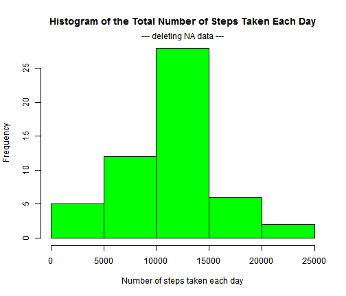
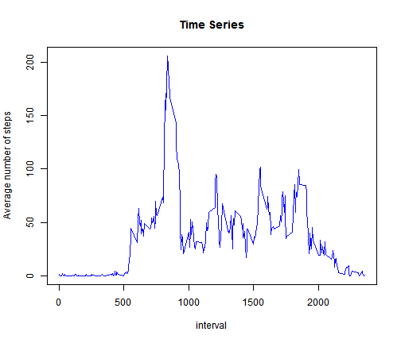
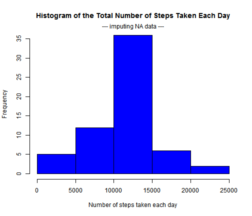
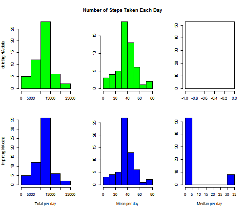
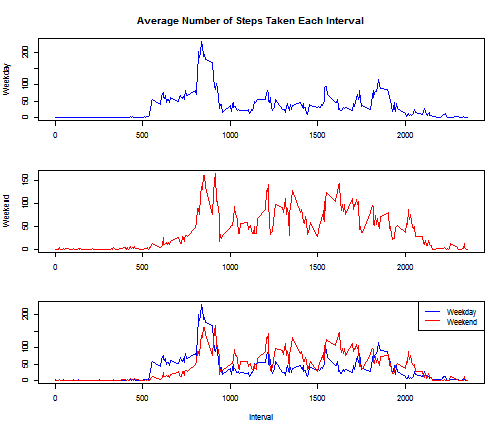

Peer Assessment_1 W2_M5
========================================================
Read de data, in the working directory, and modify the time format


```r
data <- read.csv("activity.csv", header = T)
data$date <- as.Date(data$date, "%Y-%m-%d")
```

## QUESTION No.1
### What is mean total number of steps taken per day?
**For this part of the assignment, you can ignore the missing values in the dataset**

**1. Make a histogram of the total number of steps taken each day**


```r
sum.day.deletingNA <- with(subset(data, steps != "NA"), tapply(steps, date, 
    sum))
mean.day.deletingNA <- with(subset(data, steps != "NA"), tapply(steps, date, 
    mean))
median.day.deletingNA <- with(subset(data, steps != "NA"), tapply(steps, date, 
    median))
```


```r
hist(sum.day.deletingNA, col = "green", main = "Histogram of the Total Number of Steps Taken Each Day", 
    xlab = "Number of steps taken each day")
mtext("--- deleting NA data ---")
```

 


**2. Calculate and report the mean and median total number of steps taken**
**per day**


```r
(rpta.deletingNA <- data.frame(DATE = names(mean.day.deletingNA), MEANS.DAY.delNA = as.vector(mean.day.deletingNA), 
    MEDIANS.DAY.delNA = as.vector(median.day.deletingNA)))
```

```
##          DATE MEANS.DAY.delNA MEDIANS.DAY.delNA
## 1  2012-10-02          0.4375                 0
## 2  2012-10-03         39.4167                 0
## 3  2012-10-04         42.0694                 0
## 4  2012-10-05         46.1597                 0
## 5  2012-10-06         53.5417                 0
## 6  2012-10-07         38.2465                 0
## 7  2012-10-09         44.4826                 0
## 8  2012-10-10         34.3750                 0
## 9  2012-10-11         35.7778                 0
## 10 2012-10-12         60.3542                 0
## 11 2012-10-13         43.1458                 0
## 12 2012-10-14         52.4236                 0
## 13 2012-10-15         35.2049                 0
## 14 2012-10-16         52.3750                 0
## 15 2012-10-17         46.7083                 0
## 16 2012-10-18         34.9167                 0
## 17 2012-10-19         41.0729                 0
## 18 2012-10-20         36.0938                 0
## 19 2012-10-21         30.6285                 0
## 20 2012-10-22         46.7361                 0
## 21 2012-10-23         30.9653                 0
## 22 2012-10-24         29.0104                 0
## 23 2012-10-25          8.6528                 0
## 24 2012-10-26         23.5347                 0
## 25 2012-10-27         35.1354                 0
## 26 2012-10-28         39.7847                 0
## 27 2012-10-29         17.4236                 0
## 28 2012-10-30         34.0938                 0
## 29 2012-10-31         53.5208                 0
## 30 2012-11-02         36.8056                 0
## 31 2012-11-03         36.7049                 0
## 32 2012-11-05         36.2465                 0
## 33 2012-11-06         28.9375                 0
## 34 2012-11-07         44.7326                 0
## 35 2012-11-08         11.1771                 0
## 36 2012-11-11         43.7778                 0
## 37 2012-11-12         37.3785                 0
## 38 2012-11-13         25.4722                 0
## 39 2012-11-15          0.1424                 0
## 40 2012-11-16         18.8924                 0
## 41 2012-11-17         49.7882                 0
## 42 2012-11-18         52.4653                 0
## 43 2012-11-19         30.6979                 0
## 44 2012-11-20         15.5278                 0
## 45 2012-11-21         44.3993                 0
## 46 2012-11-22         70.9271                 0
## 47 2012-11-23         73.5903                 0
## 48 2012-11-24         50.2708                 0
## 49 2012-11-25         41.0903                 0
## 50 2012-11-26         38.7569                 0
## 51 2012-11-27         47.3819                 0
## 52 2012-11-28         35.3576                 0
## 53 2012-11-29         24.4688                 0
```


## QUESTION No.2
### What is the average daily activity pattern?

**1. Make a time series plot (i.e. type = "l" ) of the 5-minute interval (x-axis)**
**and the average number of steps taken, averaged across all days (y-axis)**


```r
mean.interval <- with(subset(data, steps != "NA"), tapply(steps, interval, mean))
```


```r
plot(names(mean.interval), as.vector(mean.interval), type = "l", col = 4, xlab = "interval", 
    ylab = "Average number of steps", main = "Time Series")
```

 


**2. Which 5-minute interval, on average across all the days in the dataset,**
**contains the maximum number of steps?**


```r
(names(which(mean.interval == max(mean.interval))))
```

```
## [1] "835"
```


## QUESTION No.3
### What is the impact of imputing missing data on the estimates of the total
### daily number of steps?

**1. Calculate and report the total number of missing values in the dataset**
 (i.e. the total number of rows with NAs)

```r
sum(is.na(data$steps))
```

```
## [1] 2304
```


**2. Devise a strategy for filling in all of the missing values in the dataset.**
The strategy does not need to be sophisticated. For example, you could use
the mean/median for that day, or the mean for that 5-minute interval, etc.

```r
steps.imputingNA <- ifelse(is.na(data$steps), mean.interval[as.character(data$interval[which(is.na(data$steps))])], 
    data$steps)
```


**3. Create a new dataset that is equal to the original dataset but with the**
**missing data filled in**

```r
data.imputingNA <- data
data.imputingNA$steps <- steps.imputingNA
```


**4. Make a histogram of the total number of steps taken each day and Calculate**
**and report the mean and median total number of steps taken per day.**

```r
sum.day.imputingNA <- with(data.imputingNA, tapply(steps, date, sum))
mean.day.imputingNA <- with(data.imputingNA, tapply(steps, date, mean))
median.day.imputingNA <- with(data.imputingNA, tapply(steps, date, median))
```


```r
hist(sum.day.imputingNA, col = "blue", main = "Histogram of the Total Number of Steps Taken Each Day", 
    xlab = "Number of steps taken each day")
mtext("--- imputing NA data ---")
```

 


```r
(rpta.imputingNA <- data.frame(DATE = names(mean.day.imputingNA), MEANS.DAY.impNA = as.vector(mean.day.imputingNA), 
    MEDIANS.DAY.impNA = as.vector(median.day.imputingNA)))
```

```
##          DATE MEANS.DAY.impNA MEDIANS.DAY.impNA
## 1  2012-10-01         37.3826             34.11
## 2  2012-10-02          0.4375              0.00
## 3  2012-10-03         39.4167              0.00
## 4  2012-10-04         42.0694              0.00
## 5  2012-10-05         46.1597              0.00
## 6  2012-10-06         53.5417              0.00
## 7  2012-10-07         38.2465              0.00
## 8  2012-10-08         37.3826             34.11
## 9  2012-10-09         44.4826              0.00
## 10 2012-10-10         34.3750              0.00
## 11 2012-10-11         35.7778              0.00
## 12 2012-10-12         60.3542              0.00
## 13 2012-10-13         43.1458              0.00
## 14 2012-10-14         52.4236              0.00
## 15 2012-10-15         35.2049              0.00
## 16 2012-10-16         52.3750              0.00
## 17 2012-10-17         46.7083              0.00
## 18 2012-10-18         34.9167              0.00
## 19 2012-10-19         41.0729              0.00
## 20 2012-10-20         36.0938              0.00
## 21 2012-10-21         30.6285              0.00
## 22 2012-10-22         46.7361              0.00
## 23 2012-10-23         30.9653              0.00
## 24 2012-10-24         29.0104              0.00
## 25 2012-10-25          8.6528              0.00
## 26 2012-10-26         23.5347              0.00
## 27 2012-10-27         35.1354              0.00
## 28 2012-10-28         39.7847              0.00
## 29 2012-10-29         17.4236              0.00
## 30 2012-10-30         34.0938              0.00
## 31 2012-10-31         53.5208              0.00
## 32 2012-11-01         37.3826             34.11
## 33 2012-11-02         36.8056              0.00
## 34 2012-11-03         36.7049              0.00
## 35 2012-11-04         37.3826             34.11
## 36 2012-11-05         36.2465              0.00
## 37 2012-11-06         28.9375              0.00
## 38 2012-11-07         44.7326              0.00
## 39 2012-11-08         11.1771              0.00
## 40 2012-11-09         37.3826             34.11
## 41 2012-11-10         37.3826             34.11
## 42 2012-11-11         43.7778              0.00
## 43 2012-11-12         37.3785              0.00
## 44 2012-11-13         25.4722              0.00
## 45 2012-11-14         37.3826             34.11
## 46 2012-11-15          0.1424              0.00
## 47 2012-11-16         18.8924              0.00
## 48 2012-11-17         49.7882              0.00
## 49 2012-11-18         52.4653              0.00
## 50 2012-11-19         30.6979              0.00
## 51 2012-11-20         15.5278              0.00
## 52 2012-11-21         44.3993              0.00
## 53 2012-11-22         70.9271              0.00
## 54 2012-11-23         73.5903              0.00
## 55 2012-11-24         50.2708              0.00
## 56 2012-11-25         41.0903              0.00
## 57 2012-11-26         38.7569              0.00
## 58 2012-11-27         47.3819              0.00
## 59 2012-11-28         35.3576              0.00
## 60 2012-11-29         24.4688              0.00
## 61 2012-11-30         37.3826             34.11
```


## Do these values diff€er from the estimates from the first part of the assignment?
**----------------- Visualization**

```r
par(mfrow = c(2, 3))
par(mar = c(5.1, 4.1, 0.1, 2.1))
par(oma = c(0, 0, 4, 0))

hist(sum.day.deletingNA, col = "green", xlab = "", main = "", ylab = "deleting NA data")
hist(mean.day.deletingNA, col = "green", main = "", ylab = "", xlab = "")
hist(median.day.deletingNA, main = "", ylab = "", xlab = "")
hist(sum.day.imputingNA, col = "blue", main = "", xlab = "Total per day", ylab = "imputing NA data")
hist(mean.day.imputingNA, col = "blue", main = "", ylab = "", xlab = "Mean per day")
hist(median.day.imputingNA, col = "blue", main = "", ylab = "", xlab = "Median per day")
title(main = "Number of Steps Taken Each Day", outer = T)
```

 


**----------------- Tabular comparison**

```r
summaryComparison <- function(vector1, vector2) {
    a <- summary(vector1)
    namesT <- names(a)
    a <- as.vector(a)
    b <- as.vector(summary(vector2))
    summaryMeans <- data.frame(a, b)
    rownames(summaryMeans) <- namesT
    colnames(summaryMeans) <- c("Vector 1", "Vector 2")
    summaryMeans
}

summaryComparison(mean.day.deletingNA, mean.day.imputingNA)
```

```
##         Vector 1 Vector 2
## Min.       0.142    0.142
## 1st Qu.   30.700   34.100
## Median    37.400   37.400
## Mean      37.400   37.400
## 3rd Qu.   46.200   44.500
## Max.      73.600   73.600
```


## QUESTION No.4
### Are there diff€erences in activity patterns between weekdays and week-ends?
**For this part the weekdays() function may be of some help here. Use the dataset**
**with the filled-in missing values for this part**

**1. Create a new factor variable in the dataset with two levels - "weekday"**
**and "weekend"€ indicating whether a given date is a weekday or weekend day**

```r
we <- c(Monday = 1, Tuesday = 2, Wednesday = 3, Thursday = 4, Friday = 5, Saturday = 6, 
    Sunday = 7)
wee <- weekdays(data.imputingNA$date)
week <- we[wee]
data.imputingNA$week <- as.factor(ifelse(week < 6, "weekday", "weekend"))
```


**Make a panel plot containing a time series plot (i.e. type = "l" ) of the**
**5-minute interval (x-axis) and the average number of steps taken, averaged**
**across all weekday days or weekend days (y-axis).**

```r
meanIntervalWeekday <- with(subset(data.imputingNA, week == "weekday"), tapply(steps, 
    interval, mean))

meanIntervalWeekend <- with(subset(data.imputingNA, week == "weekend"), tapply(steps, 
    interval, mean))
```


**----------------- Visualization**

```r
par(mfrow = c(3, 1))
par(mar = c(5.1, 4.1, 0.1, 2.1))
par(oma = c(0, 0, 4, 0))
plot(names(meanIntervalWeekday), as.vector(meanIntervalWeekday), type = "l", 
    col = 4, xlab = "", ylab = "Weekday")
plot(names(meanIntervalWeekend), as.vector(meanIntervalWeekend), type = "l", 
    col = 2, xlab = "", ylab = "Weekend")
plot(names(meanIntervalWeekday), as.vector(meanIntervalWeekday), type = "l", 
    col = 4, xlab = "interval", ylab = "", main = "")
lines(names(meanIntervalWeekend), as.vector(meanIntervalWeekend), type = "l", 
    col = 2, xlab = "interval", ylab = "Average number of steps")
legend("topright", lty = 1, col = c(4, 2), legend = c("Weekday", "Weekend"))
title(main = "Average Number of Steps Taken Each Interval", outer = T)
```

 


**----------------- Tabular comparison**

```r
summaryComparison(meanIntervalWeekday, meanIntervalWeekend)
```

```
##         Vector 1 Vector 2
## Min.        0.00     0.00
## 1st Qu.     2.25     1.24
## Median     25.80    32.30
## Mean       35.60    42.40
## 3rd Qu.    50.90    74.70
## Max.      230.00   167.00
```

